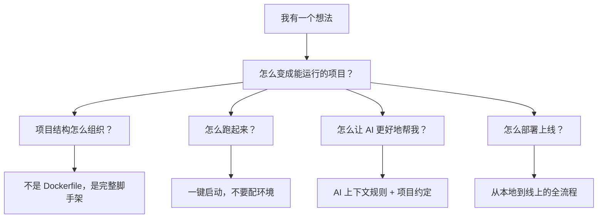

# Acorn 项目评估：非专业 AI 编程用户视角

> 评估对象：[Acorn](https://github.com/SilasFu/Acorn) — 智能项目初始化工具  
> 评估视角：**不以 AI 编程为主业、但需要借助 AI 工具（Cursor/Copilot）辅助开发的群体**  
> 典型画像：产品经理写 side project、设计师做原型、创业者 MVP、传统开发者转型 AI 辅助开发

---

## 一、项目定位与价值判断

### 1.1 项目做的事

Acorn 是一个 CLI 工具，核心功能链条：

```
扫描项目目录 → 检测语言/框架类型 → 匹配模板 → 生成 Docker/devcontainer/CI 等配置文件
```

### 1.2 对非专业用户的实际价值

| 价值维度 | 评分 | 说明 |
|---------|------|------|
| **解决真实痛点** | ⭐⭐⭐ | Docker 配置确实是非专业用户的高频障碍 |
| **降低门槛** | ⭐⭐ | 但工具本身仍需 Python/pip 环境，门槛未降到底 |
| **节省时间** | ⭐⭐⭐ | 对已有项目补充配置，确实省事 |
| **AI 编程场景增值** | ⭐⭐ | `.cursorrules` 生成有创意，但目前还很薄 |
| **学习价值** | ⭐⭐⭐⭐ | 作为 Python CLI 工程实践的范例很优秀 |

### 1.3 坦率的价值判断

> [!IMPORTANT]
> **核心矛盾**：Acorn 的目标用户是"不想手写 Dockerfile 的人"，但它的安装方式是 `pip install acorn`——这已经筛掉了大部分非专业用户。

**实际上被替代的场景有多少？**

- GitHub 上大量 boilerplate/starter repo 可以 `git clone` 一步到位
- 大多数框架本身有 `create-xxx-app` 系列工具
- Docker Desktop 现在自带 `docker init`（2023年起），功能高度重叠
- Cursor/Claude Code 可以直接用自然语言说 "帮我生成 Dockerfile"

所以 Acorn 的**差异化价值**需要更精准地回答："为什么不直接让 AI 帮我生成？"

---

## 二、从非专业用户视角看真实需求

### 2.1 他们真正需要什么

非专业 AI 编程用户的核心需求不是"生成配置文件"，而是：



### 2.2 需求与 Acorn 现状的 Gap

| 真实需求 | Acorn 覆盖程度 | Gap |
|---------|-------------|-----|
| "帮我从零建一个项目" | ⚠️ 部分覆盖 | Wizard 只问了几个问题就跳到模板匹配，不生成业务代码骨架 |
| "生成 Dockerfile" | ✅ 核心能力 | 但 `docker init` 是直接竞品 |
| "配好 AI 编程环境" | ⚠️ 有想法 | `.cursorrules` 生成内容太泛，对实际 AI 编码帮助有限 |
| "一键能跑" | ❌ 不覆盖 | 只生成文件，不帮你安装依赖或启动服务 |
| "帮我部署" | ❌ 不覆盖 | `add-ci` 只生成骨架 workflow，实际部署需要大量定制 |
| "我的项目出问题了" | ❌ 不覆盖 | 没有诊断/修复能力 |

---

## 三、当前项目存在的缺陷

### 3.1 产品层面（最重要）

#### 缺陷 1：定位模糊 — "自动检测"是开发者需求，不是用户需求

非专业用户不会说"请帮我检测项目类型并匹配模板"。他们会说"我用 Cursor 写了个 Next.js 项目，帮我配好部署的东西"。

**Acorn 目前的交互模式**过于"工具导向"，缺少"目标导向"的设计。`acorn wizard` 问的第一个问题就是"项目类型"——但如果 Acorn 真的能"智能检测"，为什么还要问用户？

> [!WARNING]
> **建议**：Wizard 应该先扫描目录，自动填充答案，让用户确认/修改，而不是从零开始问。

#### 缺陷 2：生成的文件太"基础"，没有超越 `docker init`

看一个具体例子 — Node.js 的 Dockerfile：

```dockerfile
# Acorn 生成的
FROM node:20-alpine
WORKDIR /app
COPY package*.json ./
RUN npm ci
COPY . .
EXPOSE 3000
CMD ["node", "index.js"]
```

```dockerfile
# docker init 生成的（2024+）
FROM node:20-alpine as base
WORKDIR /app
COPY package*.json ./
FROM base as deps
RUN npm ci --omit=dev
FROM base as build
RUN npm ci
COPY . .
RUN npm run build
FROM base as production
COPY --from=deps /app/node_modules ./node_modules
COPY --from=build /app/dist ./dist
EXPOSE 3000
CMD ["node", "dist/index.js"]
```

Acorn 生成的是单阶段构建、没有 `.dockerignore`、hardcoded 入口文件。Docker 官方工具已经生成多阶段构建了。

#### 缺陷 3：`.cursorrules` 生成太空泛

当前模板中 cursor_rules 的内容：

```yaml
tech_stack: "Node.js 20, Express 4, Jest"
conventions:
  - "Use CommonJS modules"
  - "Error handling with try/catch"
  - "Use environment variables for configuration"
```

这些内容对 Cursor 几乎没有增量价值——Cursor 本身就知道 Node.js 项目应该用 try/catch。真正有用的 AI 上下文应该是：

- 项目的具体 API 设计规范（REST/GraphQL 路由约定）
- 数据库 schema 或 ORM 约定
- 认证方式（JWT/Session）
- 错误码体系
- 测试策略和 mock 约定

#### 缺陷 4：安装门槛与目标用户矛盾

```bash
pip install acorn    # 需要有 Python 3.10+ 环境
```

非专业用户可能连 Python 都没装。DESIGN.md 规划了 Homebrew 和 PyInstaller 分发，但目前还未落地到可用状态（只有 CI workflow，没有 release 产物）。

### 3.2 工程层面

#### 缺陷 5：CLI 模块过于臃肿

[cli.py](file:///Users/gabriel.foo/init-project/src/acorn/cli.py) 有 **1064 行**，包含了：
- 参数解析
- CI YAML 模板（硬编码字符串）
- 颜色工具函数
- 所有命令的实现逻辑
- 完成脚本（bash/zsh/fish）

这不是一个可维护的结构。CI 模板硬编码在 Python 字符串里，无法被用户自定义或覆盖。

#### 缺陷 6：模板内容太薄

10 个内置模板，每个只有 3-4 个文件（Dockerfile、docker-compose.yml、.env.example）。与 README 宣称的能力（"智能项目初始化"）相比，实际产出物过于简陋。

以 `node-api` 为例，模板目录结构：
```
node-api/
├── Dockerfile          (153 bytes)
├── docker-compose.yml  (206 bytes)
├── .env.example        (35 bytes)
├── files/
└── template.yaml       (636 bytes)
```

用户拿到的只是 3 个非常通用的配置文件，没有项目骨架代码。

#### 缺陷 7：`docker-compose.yml` 硬编码 Node.js 配置

```python
# template_engine.py L510-523
def _generate_docker_compose(project_type: str, variables: dict[str, str]) -> str:
    port = variables.get("port", "3000")
    return f"""version: "3.8"
services:
  app:
    build: .
    ports:
      - "{port}:{port}"
    volumes:
      - .:/app
      - /app/node_modules   # ← 这行对 Python/Go/Rust 项目没有意义
    environment:
      - NODE_ENV=development  # ← 对非 Node 项目无效
"""
```

所有项目类型共用同一个 docker-compose 模板，包含 Node.js 专有配置。Python 项目也会出现 `node_modules` volume 和 `NODE_ENV` 环境变量。

#### 缺陷 8：`version: "3.8"` 已过时

Docker Compose V2 (2023+) 不再需要 `version` 字段。继续使用会产生 deprecation warning。这对于一个"智能生成"工具来说是减分项。

#### 缺陷 9：Wizard 流程断裂

`wizard.py` 的 `_map_to_options` 返回 `(options, target_dir, target_type)`，但当 `target_type` 不匹配任何模板名时（比如用户选了 "node" 但模板叫 "node-api"），会导致模板匹配失败，回退到 auto-generate 的简陋输出。

#### 缺陷 10：没有 `--uninstall` / `acorn self-remove`

作为一个会在用户系统中生成文件、写入 `~/.acorn/` 配置的工具，没有提供完整的卸载能力。`acorn clean` 只清理项目级文件，不清理全局配置。

### 3.3 文档与体验层面

#### 缺陷 11：README 过度承诺

README 列出了 `--scan`（安全扫描）、`--search`（市场搜索）、`--install`（安装社区模板）、`--analyze`（AI 分析）等高级功能，给人的印象是一个功能丰富的平台。但实际上：

- `--scan` 只做 YAML 格式校验级别的检查
- `--search` 依赖 GitHub API（有 rate limit，无 auth 时 60 次/小时）
- `--analyze` 的 AI 功能需要用户自己配置 OpenAI API key
- 社区模板生态 = 0（没有任何第三方模板）

#### 缺陷 12：双语混杂降低专业感

代码中的中英文混杂（帮助文本中文、变量名英文、注释中英交替）在实际体验中会显得不够专业。对中文用户来说不够"中文"，对英文用户来说充满看不懂的中文。

---

## 四、竞品对比

| 维度 | Acorn | `docker init` | `create-xxx-app` | 直接让 AI 写 |
|------|-------|-------------|------------------|------------|
| 安装门槛 | 需要 Python | Docker 内置 | npm/npx | 已在 IDE 中 |
| 多语言支持 | 9 种 | 5 种 | 单一 | 任意 |
| 生成质量 | 基础 | 专业 | 专业 | 定制化 |
| AI 上下文 | `.cursorrules` | 无 | 无 | 不需要 |
| 可定制性 | 模板系统 | 有限 | 有限 | 完全自由 |
| 离线使用 | ✅ | ✅ | ❌ | ❌ |
| 学习曲线 | 中 | 低 | 低 | 低 |

---

## 五、改进建议（按优先级排序）

### P0：让核心场景真正好用

1. **提升生成文件质量**：Dockerfile 应该是多阶段构建、有 `.dockerignore`、docker-compose 应该区分项目类型
2. **修复 docker-compose 的 Node.js 硬编码问题**：每种语言应有独立的 compose 模板
3. **移除 `version: "3.8"`**：跟进 Compose V2 规范

### P1：找到差异化定位

4. **深耕 AI 编程场景**：这是 `docker init` 不做的。`.cursorrules` / `.clinerules` / `CLAUDE.md` 的生成应该做深做专——分析项目的实际代码结构，生成有针对性的 AI 规则，而不是通用话术
5. **从"生成配置"转向"项目健康检查"**：`acorn doctor` — 检查项目缺什么（缺 `.gitignore`？缺测试？缺 CI？缺 Docker？），给出补全建议

### P2：降低安装门槛

6. **优先完成二进制分发**：Homebrew tap 和 GitHub Release 的 PyInstaller 产物是关键
7. **考虑做一个 npx 版本**：`npx acorn-init` — 对前端开发者更友好

### P3：克制功能扩张

8. **砍掉或标记 alpha 的功能**：marketplace/search/install/analyze 如果没有真实生态支撑，不如先隐藏，避免给用户"画饼"的感觉
9. **重构 cli.py**：拆分成多个子命令模块，CI 模板移到独立的 YAML 文件中

---

## 六、总结

**Acorn 作为一个个人项目 / 学习项目**，工程质量很不错——有完整的测试（20 个测试文件）、CI/CD、国际化、插件系统、模板引擎。代码结构清晰，设计文档详实。

**但作为一个面向非专业 AI 编程群体的工具产品**，存在根本性的定位挑战：

> 它想解决的问题（生成 Docker/CI 配置）正在被更低门槛的方案（`docker init`、AI 对话）快速蚕食。
> 
> 它潜在的差异化方向（AI 编程上下文生成）目前还停留在表层。

**最有价值的方向**是深耕 "AI 编程伴侣" 定位——不是帮人写 Dockerfile，而是帮人建立一个**让 AI 更好地理解和编写其项目代码**的环境。如果 `.cursorrules` 的生成能做到分析项目实际代码结构（路由、模型、API 约定）并生成高质量的上下文规则，这才是 `docker init` 和 `create-xxx-app` 做不到的事。
