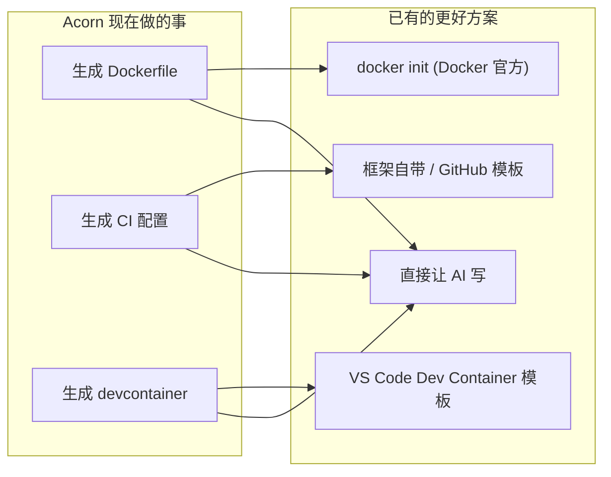
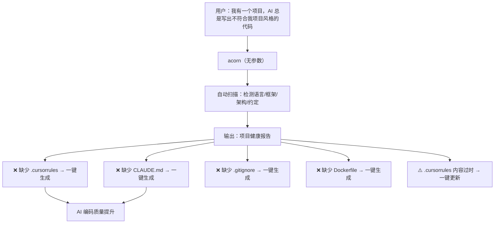

# Acorn 最佳发展路径：战略建议

> 基于对项目代码、架构、竞品格局的深度分析，给出 Acorn 的最优发展策略。

---

## 核心判断：一句话

> **Acorn 应该从"项目初始化工具"转型为"AI 编程环境优化器"——不是帮人写 Dockerfile，而是帮人建立一个让 AI 更好地理解和编写其项目代码的开发环境。**

---

## 一、为什么必须转型

### 1.1 当前赛道已是红海



Acorn 的每一个核心功能都有更成熟、更低门槛的替代品。继续在这个方向投入，是在用个人项目的资源跟大公司的产品竞争。

### 1.2 但有一个空白赛道无人占领

**"让 AI 更好地理解你的项目"** — 这个需求巨大，但没有任何工具系统性地解决：

| 需求 | 现状 |
|------|------|
| 生成 `.cursorrules` | 手写，大多数人不知道怎么写好 |
| 生成 `CLAUDE.md` | 手写，格式五花八门 |
| 生成 `.clinerules` | 手写，大多数人不知道这东西存在 |
| 让 AI 理解项目架构 | 每次对话都要重新解释 |
| 统一项目规范给 AI 遵循 | 口头约定，AI 经常忘 |

> [!IMPORTANT]
> **这正是 Acorn 的"检测引擎"最大的用武之地**——它已经能分析项目类型、框架、依赖关系。只需要把输出从"生成 Dockerfile"转向"生成 AI 上下文规则"，就能进入一个没有竞争对手的市场。

---

## 二、转型后的产品定位

### 2.1 新 Tagline

```
Before:  智能项目初始化工具 — 自动检测项目类型、匹配模板、生成配置
After:   AI 编程环境优化器 — 让 Cursor/Claude Code/Copilot 更懂你的项目
```

### 2.2 新的核心用户旅程



### 2.3 新旧功能对照

| 现有功能 | 转型后的角色 | 变化 |
|---------|------------|------|
| 项目类型检测 | **核心引擎，不变** | 从"为了匹配模板"变为"为了理解项目" |
| 模板匹配 + 生成 | 降级为辅助功能 | Docker/CI 生成保留，但不再是主打 |
| `.cursorrules` 生成 | **升级为核心功能** | 从模板硬编码 → 动态分析项目代码生成 |
| Wizard 向导 | 重塑为"项目诊断" | 从"问你要什么"变为"告诉你缺什么" |
| 模板市场 | 暂时冻结 | 等核心场景跑通后再考虑 |

---

## 三、具体实施路线图

### Phase 1（2 周）：`acorn doctor` — 项目健康诊断

**这是新的"前门命令"，替代现有的 `acorn`（无参数进 wizard）。**

#### 用户体验

```bash
$ cd my-nextjs-project
$ acorn

🔍 Scanning project...

╭──────────────────────────────────────────────────╮
│  Acorn Project Report                            │
│  Project: my-nextjs-project                      │
│  Type: Node.js (Next.js) — 95% confidence        │
│  Framework: Next.js 14 + App Router              │
╰──────────────────────────────────────────────────╯

  AI Readiness:
  ✗ No .cursorrules found          [acorn fix --cursorrules]
  ✗ No CLAUDE.md found             [acorn fix --claude-md]
  ✗ No .clinerules found           [acorn fix --clinerules]

  DevOps Readiness:
  ✓ Dockerfile exists
  ✗ No .dockerignore               [acorn fix --dockerignore]
  ✗ No CI configuration            [acorn fix --ci]
  ✓ .gitignore exists

  Code Quality:
  ✓ ESLint configured
  ✗ No Prettier config             [acorn fix --prettier]
  ✓ TypeScript enabled

  Run 'acorn fix' to auto-fix all issues.
  Run 'acorn fix --ai' to fix AI readiness issues only.
```

#### 实现要点

```python
# 新增 src/acorn/doctor.py

@dataclass
class HealthCheck:
    category: str          # "ai_readiness", "devops", "code_quality"
    name: str              # ".cursorrules"
    status: bool           # exists and valid?
    fix_command: str        # "acorn fix --cursorrules"
    priority: str          # "high", "medium", "low"

def diagnose(dir_path: Path) -> list[HealthCheck]:
    """扫描项目，返回健康检查清单"""
    checks = []
    detection = detect_project_type(dir_path)
    
    # AI Readiness checks
    checks.append(HealthCheck(
        category="ai_readiness",
        name=".cursorrules",
        status=(dir_path / ".cursorrules").exists(),
        fix_command="acorn fix --cursorrules",
        priority="high",
    ))
    checks.append(HealthCheck(
        category="ai_readiness",
        name="CLAUDE.md",
        status=(dir_path / "CLAUDE.md").exists(),
        fix_command="acorn fix --claude-md",
        priority="high",
    ))
    # ... DevOps + Code Quality checks
    return checks
```

**关键点**：这个功能复用现有的 `detector.py` 引擎，不需要重写，只需要把检测结果转化为"缺什么"的诊断报告。

#### 现有代码改动量

| 文件 | 改动 |
|------|------|
| `cli.py` | 修改 `main()` 的无参数行为：从 `cmd_wizard()` → `cmd_doctor()` |
| `doctor.py` | **新增**，~200 行 |
| `fix.py` | **新增**，调用现有的模板引擎 + 新的 AI 上下文生成器 |

---

### Phase 2（3 周）：深度 AI 上下文生成 — 核心差异化

**这是整个转型的关键。现有的 `.cursorrules` 生成是从模板硬编码的，新版本要能动态分析项目代码。**

#### 分析维度

```python
# 新增 src/acorn/ai_context.py

@dataclass
class ProjectInsight:
    """从代码中提取的项目洞察"""
    
    # 基础信息（现有 detector 已能提供）
    language: str                    # "typescript"
    framework: str                   # "next.js"
    package_manager: str             # "pnpm"
    
    # 架构分析（新增）
    architecture_pattern: str        # "app-router", "pages-router", "monorepo"
    directory_structure: dict        # {"src/app": "routes", "src/lib": "utilities", ...}
    entry_points: list[str]          # ["src/app/layout.tsx"]
    
    # 约定提取（新增，通过 AST-lite 分析）
    import_style: str                # "absolute" | "relative" | "path-alias"
    module_system: str               # "esm" | "commonjs"
    naming_convention: str           # "camelCase" | "snake_case" | "kebab-case"
    state_management: str | None     # "zustand" | "redux" | "context" | None
    styling_approach: str | None     # "tailwind" | "css-modules" | "styled-components"
    orm_or_db: str | None            # "prisma" | "drizzle" | "mongoose" | None
    auth_pattern: str | None         # "next-auth" | "clerk" | "custom-jwt"
    test_framework: str | None       # "jest" | "vitest" | "pytest"
    
    # API 分析（新增）
    api_style: str | None            # "rest" | "graphql" | "trpc" | "grpc"
    api_routes: list[str]            # ["/api/users", "/api/posts"]
```

#### 生成的 `.cursorrules` 示例（对比）

**现在生成的（空泛无用）：**
```
You are an expert in the following technology stack.
Tech Stack: Node.js 20, Express 4, Jest
Key Conventions:
- Use CommonJS modules
- Error handling with try/catch
```

**转型后生成的（有实际价值）：**
```markdown
# Project: my-nextjs-project

## Architecture
This is a Next.js 14 App Router project with the following structure:
- `src/app/` — Route handlers and pages (App Router pattern)
- `src/components/` — Reusable React components
- `src/lib/` — Utility functions and shared logic
- `src/server/` — Server-side code (tRPC routers, DB queries)
- `prisma/` — Database schema and migrations

## Tech Stack
- **Runtime**: Node.js 20, TypeScript 5.3
- **Framework**: Next.js 14 (App Router, Server Components)
- **Styling**: Tailwind CSS 3.4 + shadcn/ui
- **State**: Zustand for client state, React Query for server state
- **Database**: PostgreSQL via Prisma ORM
- **Auth**: NextAuth.js v5 (session-based)
- **Testing**: Vitest + React Testing Library
- **Package Manager**: pnpm

## Coding Conventions
- Use absolute imports with `@/` path alias (e.g., `import { Button } from "@/components/ui/button"`)
- Components use PascalCase filenames, utilities use camelCase
- Server Components by default; add `"use client"` only when needed
- API routes follow RESTful naming: `src/app/api/[resource]/route.ts`
- Database queries go in `src/server/db/` — never call Prisma directly in components
- Use Zod for all input validation (API routes and form inputs)
- Error handling: use `src/lib/errors.ts` error classes, never raw `throw new Error()`

## File Patterns
- New pages: `src/app/[route]/page.tsx` (Server Component)
- New API routes: `src/app/api/[resource]/route.ts` (Route Handler)
- New components: `src/components/[feature]/[ComponentName].tsx`
- New server actions: `src/server/actions/[feature].ts`
- Database changes: modify `prisma/schema.prisma`, then `pnpm db:push`

## Do NOT
- Do not use `getServerSideProps` or `getStaticProps` (this is App Router)
- Do not install axios (use native fetch or server actions)
- Do not put business logic in components — extract to `src/lib/` or `src/server/`
- Do not use CSS-in-JS libraries (project uses Tailwind)
```

> [!IMPORTANT]
> **这就是 `docker init` 和 `create-xxx-app` 永远做不到的事。** 因为它们不分析你的项目代码，而 Acorn 的检测引擎天生就干这个。

#### 技术实现：不需要 AST，正则 + 启发式就够

不需要引入重量级的 AST 解析器。用现有的文件扫描 + 正则匹配就能提取大部分信息：

```python
def _detect_import_style(dir_path: Path) -> str:
    """检测导入风格：绝对路径/相对路径/路径别名"""
    for f in dir_path.rglob("*.ts"):
        content = f.read_text(errors="ignore")
        if re.search(r'from\s+["\']@/', content):
            return "path-alias (@/)"
        if re.search(r'from\s+["\']\.\./', content):
            return "relative"
    return "unknown"

def _detect_styling(dir_path: Path) -> str | None:
    """检测样式方案"""
    if (dir_path / "tailwind.config.js").exists() or (dir_path / "tailwind.config.ts").exists():
        return "tailwind"
    pkg = _read_package_json(dir_path)
    if pkg:
        deps = {**pkg.get("dependencies", {}), **pkg.get("devDependencies", {})}
        if "styled-components" in deps: return "styled-components"
        if "@emotion/react" in deps: return "emotion"
    if list(dir_path.rglob("*.module.css")):
        return "css-modules"
    return None

def _detect_api_routes(dir_path: Path) -> list[str]:
    """提取 API 路由列表"""
    routes = []
    for f in dir_path.rglob("route.ts"):
        rel = f.relative_to(dir_path)
        # src/app/api/users/route.ts → /api/users
        route = "/" + "/".join(p for p in rel.parts[2:-1])
        routes.append(route)
    return routes
```

**关键洞察**：Acorn 现有的 `detector.py` 已经有 `_read_file_safe`、`_find_files_recursive`、`_check_content_recursive`、`_check_dependencies` 这些基础设施。新的分析代码只是在这些基础上增加更细粒度的检测维度。

#### 支持多种 AI 工具的输出

```bash
$ acorn fix --ai

Generating AI context files...
  ✓ .cursorrules        (for Cursor)
  ✓ CLAUDE.md           (for Claude Code / Anthropic)  
  ✓ .github/copilot-instructions.md  (for GitHub Copilot)
  ✓ .clinerules         (for Cline/Roo Code)

All AI coding tools are now configured for this project.
```

一次生成，覆盖所有主流 AI 编程工具。这才是真正的"一条命令解决问题"。

---

### Phase 3（2 周）：`acorn sync` — 保持 AI 上下文与项目同步

当项目代码变化后，AI 上下文规则会过时。`acorn sync` 解决这个问题：

```bash
# 作为 git hook 运行
$ acorn sync

Checking AI context freshness...
  ⚠ .cursorrules mentions "Prisma" but drizzle-orm found in package.json
  ⚠ New API route /api/payments detected but not in .cursorrules
  ⚠ CLAUDE.md references src/utils/ but directory renamed to src/lib/

  Updated 3 file(s). Review changes with: git diff
```

```bash
# 配置为 pre-commit hook
$ acorn sync --hook install
✓ Installed pre-commit hook for AI context sync
```

---

## 四、需要砍掉或冻结的功能

转型意味着聚焦。以下功能建议**立即冻结**，不再投入开发精力：

| 功能 | 处理方式 | 原因 |
|------|---------|------|
| `--search` / `--install` 市场 | 🧊 冻结 | 没有生态，是空壳。等用户量起来再做 |
| `--analyze --allow-ai` AI 分析 | 🔄 重定向 | 把 LLM 调用的精力转到 AI 上下文生成上 |
| 模板组合系统 `--with` | 🧊 冻结 | 过度设计，用户还没到这个阶段 |
| 遥测系统 | 🧊 冻结 | 没有用户的时候遥测没有意义 |
| Shell 补全脚本 | 保留不动 | 已完成，维护成本为零 |

---

## 五、工程层面的配套改进

### 5.1 拆分 `cli.py`

当前 1064 行的 `cli.py` 是发展瓶颈。推荐结构：

```
src/acorn/
├── cli.py              # 仅保留 argparse + 路由分发（~150行）
├── commands/
│   ├── __init__.py
│   ├── doctor.py       # acorn（无参数）/ acorn doctor
│   ├── fix.py          # acorn fix [--ai|--devops|--all]
│   ├── sync.py         # acorn sync
│   ├── generate.py     # acorn generate（原 cmd_generate）
│   ├── template.py     # --list / --add / --remove
│   └── admin.py        # --export / --import / --validate / etc.
├── analysis/
│   ├── detector.py     # 现有的项目类型检测（不变）
│   ├── insights.py     # 新增：深度项目洞察提取
│   └── health.py       # 新增：健康检查规则
├── generators/
│   ├── cursorrules.py  # .cursorrules 生成器
│   ├── claude_md.py    # CLAUDE.md 生成器
│   ├── copilot.py      # copilot-instructions.md 生成器
│   ├── dockerfile.py   # Dockerfile 生成（从 template_engine.py 提取）
│   └── ci.py           # CI 配置生成（从 cli.py 提取）
└── ...（其余不变）
```

### 5.2 修复已知的低级问题

这些应该在 Phase 1 **一起修掉**，它们损害工具的可信度：

| 问题 | 修复 | 工作量 |
|------|------|--------|
| `docker-compose.yml` 所有语言写 `node_modules` | 按 `project_type` 区分模板 | 0.5 天 |
| `version: "3.8"` 已过时 | 删除 `version` 字段 | 5 分钟 |
| Dockerfile 单阶段构建 | 改为多阶段（至少 Node/Go/Java/Rust） | 1 天 |
| 缺少 `.dockerignore` 生成 | 各语言添加默认 `.dockerignore` | 0.5 天 |

### 5.3 安装门槛降低

| 优先级 | 方案 | 说明 |
|--------|------|------|
| **P0** | `brew install acorn` | 完成 Homebrew tap，release workflow 已有雏形 |
| **P1** | `npx @acorn-dev/cli` | 用 Node.js 包装 Python 二进制，触达前端开发者 |
| **P2** | GitHub Action | `uses: SilasFu/acorn-action@v1` — CI 中自动检查 AI 上下文 |

---

## 六、新的 README 故事线

```markdown
# 🌰 Acorn

Make your project AI-ready — one command to optimize Cursor, Claude Code, 
Copilot, and Cline for your codebase.

## Why?

AI coding tools work best when they understand your project's conventions.
But manually writing `.cursorrules`, `CLAUDE.md`, and `.clinerules` is 
tedious and they go stale fast.

Acorn scans your project, understands its architecture, and generates 
rich context files that make AI write code YOUR way.

## Quick Start

$ acorn

🔍 Detected: Next.js 14 (App Router) + Tailwind + Prisma

AI Readiness:
  ✗ No .cursorrules     →  acorn fix --cursorrules
  ✗ No CLAUDE.md        →  acorn fix --claude-md

$ acorn fix --ai
  ✓ Generated .cursorrules (42 rules, 3 sections)
  ✓ Generated CLAUDE.md (project architecture + conventions)
  ✓ Generated .github/copilot-instructions.md

Your AI tools now understand your project. Try it — ask Cursor 
to "add a new API route" and watch it follow your conventions.
```

这个故事比"自动检测并生成 Dockerfile"有力得多，因为：
1. **痛点更真实** — 每个用 AI 编程的人都经历过"AI 不懂我的项目约定"
2. **竞品更少** — 没人系统地做这个
3. **效果可验证** — 用户生成后立刻能在 AI 对话中看到差异
4. **高频使用** — 项目变化就要 sync，不是一次性工具

---

## 七、成功指标

| 指标 | 现在 | Phase 1 目标 | Phase 2 目标 |
|------|------|-------------|-------------|
| GitHub Stars | ~0 | 50 | 300 |
| `acorn doctor` 输出项数 | 不存在 | 12+ 检查项 | 20+ 检查项 |
| AI 上下文生成维度 | 4 条通用规则 | 15+ 维度 | 30+ 维度，含代码分析 |
| 支持的 AI 工具 | 仅 Cursor | Cursor + Claude Code | + Copilot + Cline |
| 安装方式 | pip only | + brew | + npx |

---

## 八、总结：三步走

```
         现在                    Phase 1                  Phase 2                  Phase 3
    ┌─────────────┐        ┌─────────────────┐      ┌───────────────────┐    ┌──────────────┐
    │ 项目初始化   │  ──►   │ acorn doctor    │ ──►  │ 深度 AI 上下文    │──► │ acorn sync   │
    │ 工具        │        │ 项目健康诊断     │      │ 代码分析 + 生成    │    │ 持续同步     │
    │ (红海竞争)  │        │ (新前门)         │      │ (核心差异化)       │    │ (用户粘性)   │
    └─────────────┘        └─────────────────┘      └───────────────────┘    └──────────────┘
                              2 周                      3 周                    2 周
```

> [!TIP]
> **最关键的第一步**：修改 `main()` 函数，把无参数行为从 `cmd_wizard()` 改为 `cmd_doctor()`。这一行代码的改动，就是整个产品方向的转折点。

Acorn 的检测引擎、模板系统、i18n、插件架构——这些都是优秀的基础设施。它们不需要被丢弃，只需要被指向一个更有价值的方向。

**不要做 `docker init` 的竞品。做 AI 编程时代的 `editorconfig`。**
